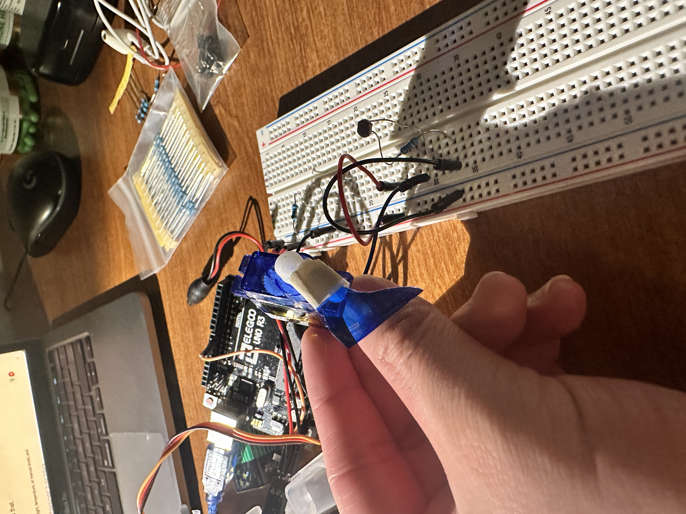

# Servo-Controlled Object Reacting to Light

This project creates an interactive object that responds to ambient light levels using a servo motor and a Light Dependent Resistor (LDR). The object mimics "waking up" in the presence of light and "sleeping" when it stays dark for too long.

## Features

- **Light-Responsive Speed:** The servo sweeps back and forth. The brighter the light, the faster it moves.
- **Sleep Mode:** If the environment remains dark (sensor value > 700) for more than 3 seconds, the object stops moving and enters a "sleep" state.
- **Auto-Wake:** As soon as light is detected again, the object wakes up and resumes movement.

## Project Assets



### Video Demo

[Watch the project video](assets/project_video.mov)

## Hardware List

- **Microcontroller:** Arduino Uno, Nano, or compatible board.
- **Actuator:** SG90 Micro Servo (or standard 5V servo).
- **Sensor:** Light Dependent Resistor (LDR) / Photoresistor.
- **Resistor:** 10kΩ Resistor (for the LDR voltage divider circuit).
- **Miscellaneous:** Breadboard and jumper wires.

## Wiring / Pinout

| Component | Pin on Arduino | Notes |
| :--- | :--- | :--- |
| **LDR Output** | `A0` | Connect in a voltage divider configuration with the 10kΩ resistor. |
| **Servo Signal** | `D9` | PWM capable pin. |
| **Servo VCC** | `5V` | |
| **Servo GND** | `GND` | |

**Note:** For the LDR circuit, connect one leg of the LDR to 5V. Connect the other leg to both Pin A0 and one leg of the 10kΩ resistor. Connect the other leg of the 10kΩ resistor to GND.

## Installation & Usage

1.  **Clone the repository:**
    ```bash
    git clone https://github.com/Dafu-Liu/com-obj-gesture.git
    cd com-obj-gesture
    ```

2.  **Open with PlatformIO:**
    - Open Visual Studio Code.
    - Ensure the PlatformIO extension is installed.
    - Open the project folder.

3.  **Upload:**
    - Connect your Arduino board.
    - Click the "Upload" arrow in the PlatformIO toolbar.

4.  **Monitor:**
    - Open the Serial Monitor (baud rate 9600) to see debug output regarding light levels and states.
